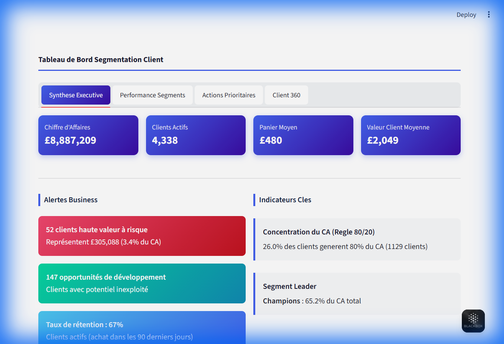
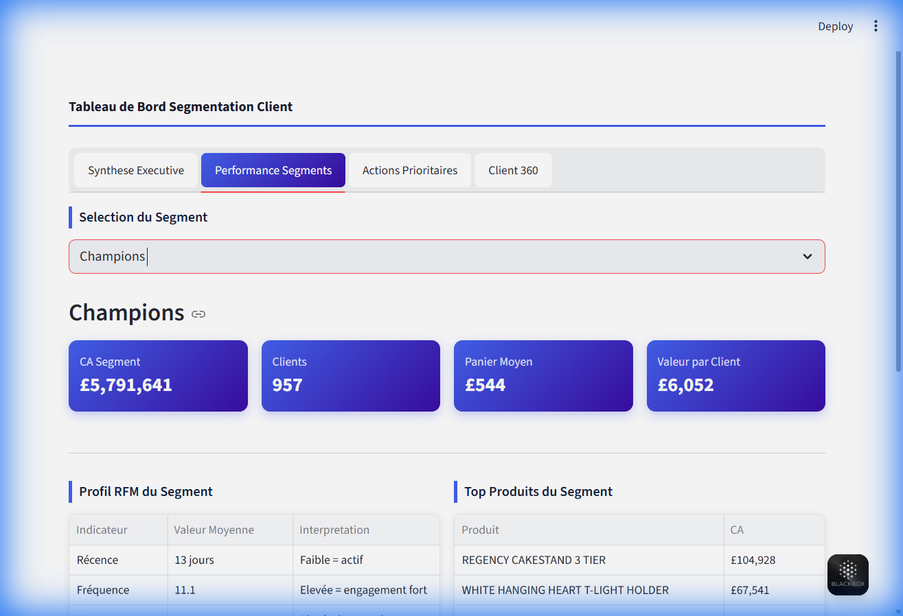
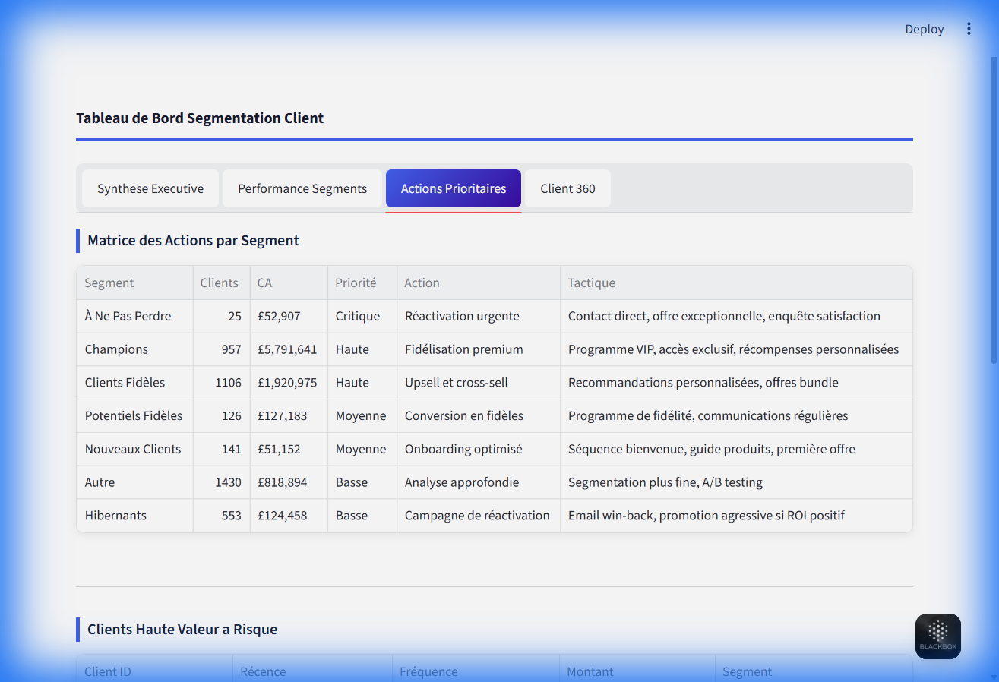
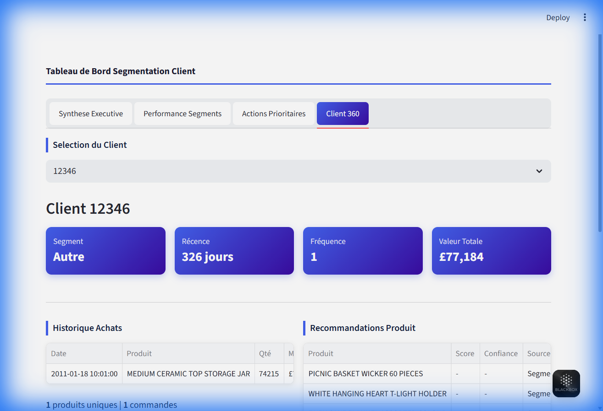

# Guide Utilisateur — Tableau de Bord Segmentation Client

Ce guide presente les fonctionnalites du tableau de bord pour vous aider a exploiter pleinement les donnees clients.

---

## Acces a l'Application

**Lien**: [customer-segmentation-project-591h.onrender.com](https://customer-segmentation-project-591h.onrender.com/)

> **Note**: L'application est hebergee sur le plan gratuit de Render. Le premier chargement peut prendre 30 a 60 secondes si le serveur est en veille.

---

## 1. Synthese Executive

Cette vue offre une vision globale de la performance commerciale.

### Indicateurs Affiches

| Indicateur | Description |
|------------|-------------|
| **Chiffre d'Affaires** | Total des ventes sur la periode |
| **Clients Actifs** | Nombre de clients uniques |
| **Panier Moyen** | Valeur moyenne par commande |
| **Valeur Client Moyenne** | CA moyen par client |

### Alertes Business

- **Clients haute valeur a risque** : Clients importants qui n'ont pas achete recemment
- **Opportunites de developpement** : Clients avec potentiel de croissance
- **Taux de retention** : Pourcentage de clients actifs dans les 90 derniers jours

### Indicateurs Cles

- **Regle 80/20** : Quel pourcentage de clients genere 80% du CA
- **Segment Leader** : Le segment le plus rentable

---

## 2. Performance Segments

Cette vue permet d'analyser chaque segment client en detail.

### Comment Utiliser

1. Selectionnez un segment dans la liste deroulante
2. Consultez les metriques specifiques au segment
3. Analysez le profil RFM moyen

### Segments Disponibles

| Segment | Description |
|---------|-------------|
| **Champions** | Meilleurs clients, achats frequents et recents |
| **Clients Fideles** | Clients reguliers a forte valeur |
| **Potentiels Fideles** | Clients a potentiel de fidelisation |
| **Nouveaux Clients** | Clients recemment acquis |
| **A Ne Pas Perdre** | Anciens bons clients a reactiver |
| **Hibernants** | Clients inactifs depuis longtemps |

### Profil RFM

- **Recence** : Nombre de jours depuis le dernier achat
- **Frequence** : Nombre de commandes passees
- **Montant** : Valeur totale des achats

---

## 3. Actions Prioritaires

Cette vue presente les actions recommandees pour chaque segment.

### Matrice des Actions

Le tableau affiche pour chaque segment :
- **Priorite** : Critique, Haute, Moyenne ou Basse
- **Action** : Objectif strategique
- **Tactique** : Methode de mise en oeuvre

### Niveaux de Priorite

| Priorite | Signification |
|----------|---------------|
| **Critique** | Action immediate requise |
| **Haute** | A traiter cette semaine |
| **Moyenne** | A planifier ce mois |
| **Basse** | A considerer |

### Clients Haute Valeur a Risque

Liste des clients importants n'ayant pas achete recemment. Ces clients doivent etre contactes en priorite.

---

## 4. Client 360

Cette vue propose une analyse individuelle de chaque client.

### Comment Utiliser

1. Selectionnez un client par son identifiant
2. Consultez son profil complet
3. Utilisez les recommandations pour personnaliser vos actions

### Informations Affichees

- **Segment** : Categorie du client
- **Recence** : Derniere activite
- **Frequence** : Nombre d'achats
- **Valeur Totale** : CA genere

### Historique d'Achats

Liste des 10 dernieres transactions avec :
- Date d'achat
- Produit achete
- Quantite
- Montant

### Recommandations Produit

Suggestions personnalisees basees sur :
- **Score (Lift)** : Force de l'association entre produits
- **Confiance** : Probabilite d'achat conjoint
- **Source** : Methode de recommandation (Association ou Segment)

---

## Bonnes Pratiques

1. **Consultez regulierement** la Synthese Executive pour suivre les KPIs
2. **Identifiez les segments** a cibler en priorite via Actions Prioritaires
3. **Utilisez Client 360** pour preparer vos actions commerciales individuelles
4. **Exportez les donnees** si necessaire en cliquant sur les tableaux

---

## Support

Pour toute question, contactez moi
